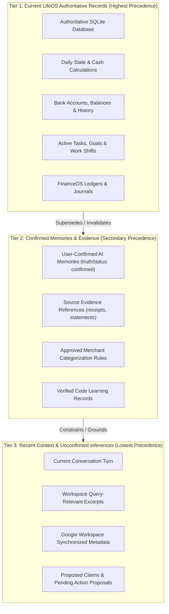
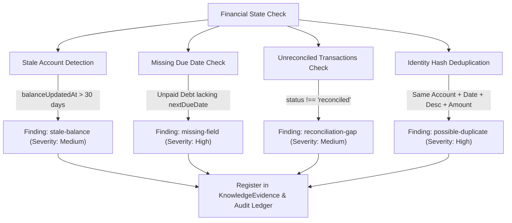
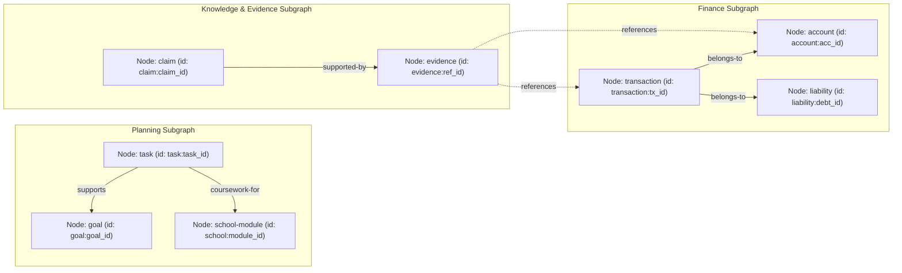

# LifeOS Antigravity — Backend & Knowledge Engine Specialist Specification

This document defines the architectural standards, schemas, graph topologies, context hierarchies, and operational rules governing the **Knowledge Engine**, **AI Diagnostics**, and **Vision Parsing** subsystems within the LifeOS isolated worktree.

---

## 1. Domain Overview & Responsibilities

As the **Backend and Knowledge Engine Specialist**, the domain encompasses the core intelligence pipeline and server modules that ingest, analyze, reconcile, and present life data to the AI assistant while guaranteeing privacy, auditability, and mathematical integrity.

### Primary Subsystem Modules

| Subsystem | Core Files | Responsibility |
| :--- | :--- | :--- |
| **Knowledge Engine** | [`server/knowledgeEngine.ts`](file:///home/p3rc/projects/Life0S/.orca/worktrees/antigravity/server/knowledgeEngine.ts) | Continuous background event observation, queued analysis, deduplication, claim generation, and proposal staging. |
| **AI Context Registry** | [`server/aiContextRegistry.ts`](file:///home/p3rc/projects/Life0S/.orca/worktrees/antigravity/server/aiContextRegistry.ts) | Declarative domain boundary management, workspace-specific context filtering, and authoritative source mapping. |
| **AI Diagnostics & Memory** | [`server/aiDiagnostics.ts`](file:///home/p3rc/projects/Life0S/.orca/worktrees/antigravity/server/aiDiagnostics.ts) | Stale memory supersession detection, conflicting record identification, and retrieval grounding audits. |
| **Deterministic Fallback** | [`server/aiFallback.ts`](file:///home/p3rc/projects/Life0S/.orca/worktrees/antigravity/server/aiFallback.ts) | Offline local summaries, failure isolation, and provider-independent state synthesis. |
| **Vision Parsing & OCR** | [`server/ocrSupport.ts`](file:///home/p3rc/projects/Life0S/.orca/worktrees/antigravity/server/ocrSupport.ts), [`server.ts`](file:///home/p3rc/projects/Life0S/.orca/worktrees/antigravity/server.ts#L1900-L2130) | Platform-safe document OCR (Apple Vision on macOS, NVIDIA Llama Vision fallback on Linux), HEIC file safety, and receipt/statement parsing. |
| **Vector Storage & Retrieval** | [`server/qdrant.ts`](file:///home/p3rc/projects/Life0S/.orca/worktrees/antigravity/server/qdrant.ts) | Hybrid dense vector storage with live Gemini embeddings (`text-embedding-004`) and deterministic 1536-dimension local feature-hashing fallback. |
| **Event Bus** | [`server/eventBus.ts`](file:///home/p3rc/projects/Life0S/.orca/worktrees/antigravity/server/eventBus.ts) | In-process decoupled asynchronous domain event publishing and subscription pipeline. |
| **Code & Concept Learning** | [`server/codeLearning.ts`](file:///home/p3rc/projects/Life0S/.orca/worktrees/antigravity/server/codeLearning.ts) | Verification and tracking of conceptual understanding across 5 progressive stages (`generated` → `reviewed` → `tested` → `explained` → `owned`). |

---

## 2. Strict Context Hierarchy

To prevent hallucinations, data drift, and stale memory reliance, all AI reasoning in LifeOS strictly enforces a **3-Tier Context Hierarchy**.



### Hierarchy Precedence Rules

1. **Tier 1: Current LifeOS Records First (Authoritative)**
   - Persisted SQLite records in [`server/sqliteStore.ts`](file:///home/p3rc/projects/Life0S/.orca/worktrees/antigravity/server/sqliteStore.ts) and computed daily states represent ground truth.
   - If an account balance, task state, or debt balance has been modified in Tier 1, any previous AI memory referencing that entity is automatically marked stale by [`excludeMemoriesSupersededByCurrentRecords`](file:///home/p3rc/projects/Life0S/.orca/worktrees/antigravity/server/aiDiagnostics.ts#L7-L14) and excluded from the active prompt context.
   - Financial figures must reflect exact ledger calculations; AI must never estimate balances or substitute income minus expenses for actual bank cash.

2. **Tier 2: Confirmed Memories Second**
   - Only active memories with `verificationStatus === "user-confirmed"` or `truthStatus === "confirmed"` are treated as established personal facts.
   - Source priorities determine evidentiary weight:
     - `user-confirmed` (Weight: 100)
     - `source-document` (Weight: 95)
     - `structured-record` (Weight: 80)
     - `deterministic` (Weight: 70)
     - `confirmed-knowledge` (Weight: 60)
     - `conversation` (Weight: 30)
     - `ai-inference` (Weight: 10)

3. **Tier 3: Recent Context Last**
   - Ephemeral chat context, query-matched drive index excerpts, synchronized metadata, and unapproved AI claims (`truthStatus: "proposed"`) cannot override Tier 1 or Tier 2.
   - Unapproved inferences and proposed actions require explicit user approval via the [`AiActionCenter`](file:///home/p3rc/projects/Life0S/.orca/worktrees/antigravity/src/components/AiActionCenter.tsx) before transitioning to authoritative storage.

---

## 3. Continuous Event Analysis Schemas

The Knowledge Engine continuously monitors state changes via [`observeDatabaseSaves`](file:///home/p3rc/projects/Life0S/.orca/worktrees/antigravity/server.ts#L1156) and computes deterministic SHA-256 fingerprints across domains to stage asynchronous analysis without blocking request transactions.

### Domain Groupings

| Domain | Monitored Collections |
| :--- | :--- |
| `finance` | `bankAccounts`, `financeEntries`, `debts`, `liabilityPayments`, `bankTransactions`, `merchantCategoryRules`, `accountBalanceHistory` |
| `goals` | `goals`, `projects` |
| `tasks` | `tasks` |
| `daily` | `habits`, `focusSessions`, `dailyReviews` |
| `work` | `workShifts`, `workTasks`, `careerProfiles` |
| `school` | `tasks` (filtered by `contextTags` containing `"school"`) |
| `memory` | `aiMemories`, `aiMemoryCandidates`, `aiDecisions` |

### Core Data Schemas

#### KnowledgeSettings
```typescript
interface KnowledgeSettings {
  enabled: boolean;
  eventAnalysis: boolean;
  nightlyTime: string;          // Format "HH:MM" (default: "02:30")
  timezone: string;             // e.g., "Africa/Johannesburg"
  providerPolicy: "full-relevant" | "summaries" | "local-only";
  domains: string[];            // Monitored domain keys
  dailyTokenBudget: number;     // e.g., 20,000 tokens
  retentionDays: number;        // History cleanup window (default: 365)
  lastNightlyDate: string | null;
}
```

#### KnowledgeAnalysisQueueItem
```typescript
interface KnowledgeAnalysisQueueItem {
  id: string;                   // UUID v4
  dedupeKey: string;            // SHA-256 hash of (version + sorted domains + domain fingerprints)
  domains: string[];            // Domains targeted for this run
  reason: "record-change" | "nightly" | "manual" | "startup-catch-up";
  status: "pending" | "processing" | "completed" | "failed";
  attempts: number;             // Retry counter (max 3 with exponential backoff)
  dueAt: string;                // ISO 8601 execution timestamp
  createdAt: string;            // ISO 8601 creation timestamp
  recoveredAfterRestart?: boolean;
}
```

#### KnowledgeAnalysisRun
```typescript
interface KnowledgeAnalysisRun {
  id: string;                   // UUID v4
  queueId: string;              // Associated queue item ID
  analysisVersion: string;      // e.g., "knowledge-v1"
  domains: string[];
  reason: string;
  status: "running" | "completed" | "failed";
  provider: "local-deterministic" | "configured-provider";
  inputFingerprint: string;
  findings: DeterministicFinding[];
  proposalsCreated: number;
  claimsCreated: number;
  inputTokens: number;
  outputTokens: number;
  startedAt: string;
  completedAt: string | null;
  error: string | null;
  nextRetryAt: string | null;
  durationMs: number;
}
```

#### KnowledgeClaim & KnowledgeEvidence
```typescript
interface KnowledgeClaim {
  id: string;
  claimHash: string;            // SHA-256 of { content, domain }
  content: string;              // Factual claim text (max 1000 chars)
  domain: string;
  claimType: string;            // "fact" | "inference" | "routine" | "preference"
  confidence: number;           // Capped at 0.89 for AI inference; 1.0 for user-confirmed
  truthStatus: "proposed" | "confirmed" | "rejected";
  freshnessStatus: "current" | "unverified" | "stale" | "superseded";
  effectiveDate: string | null;
  lastVerifiedAt: string | null;
  sourceType: "ai-inference" | "deterministic" | "user-confirmed" | "source-document";
  sourcePriority: number;
  evidenceRefs: string[];       // Foreign keys to KnowledgeEvidence items
  analysisRunId: string;
  originatingRunId: string;
  supersessionHistory: string[];
  status: "pending" | "active" | "rejected";
  createdAt: string;
  updatedAt: string;
}

interface KnowledgeEvidence {
  id: string;                   // e.g., "finding:stale-account:acc_123"
  label: string;
  sourceType: "deterministic" | "source-document" | "structured-record";
  sourcePriority: number;
  entityType: string | null;    // "account" | "liability" | "transaction" | "goal"
  entityId: string | null;
  contentHash: string;
  analysisRunId: string;
  createdAt: string;
}
```

#### AiActionProposal (Guarded Write Boundary)
```typescript
interface AiActionProposal {
  id: string;
  dedupeKey: string;
  type: "knowledge_claim" | "transaction_category" | "task_schedule";
  title: string;
  explanation: string;
  payload: Record<string, unknown>; // Sanitized proposal data
  evidenceRefs: string[];
  confidence: number;               // [0.0 - 0.89]
  impact: string;
  rollback: Record<string, unknown>;// Complete rollback instruction
  status: "pending" | "approved" | "rejected";
  provider: string;
  analysisRunId: string;
  createdAt: string;
  decidedAt?: string;
}
```

---

## 4. Finance Intelligence Graphs

LifeOS merges deterministic mathematical audit rules with a structural graph topology linking accounts, liabilities, transactions, goals, claims, and verified evidence.

### 1. Deterministic Finance Analysis Engine

Executed purely in TypeScript via [`analyzeFinanceDeterministically`](file:///home/p3rc/projects/Life0S/.orca/worktrees/antigravity/server/knowledgeEngine.ts#L84-L93):



### 2. Knowledge Graph Topology

Constructed by [`buildKnowledgeGraph`](file:///home/p3rc/projects/Life0S/.orca/worktrees/antigravity/server/knowledgeEngine.ts#L95-L109):



---

## 5. Vision Parsing & Document Ingestion

LifeOS implements a cross-platform OCR pipeline that processes financial statements, receipts, and invoices without data loss or unauthorized cloud exposure:

```mermaid
flowchart TD
    Upload["Document Uploaded (Image / Statement)"] --> CheckFormat{"Format Check (MIME)"}
    
    CheckFormat -->|HEIC / HEIF on Linux| LinuxHEIC["Retain Original File Safely & Return Clear Warning (Skip Apple Vision)"]
    CheckFormat -->|PNG / JPEG / PDF| PlatformCheck{"Host Platform"}
    
    PlatformCheck -->|macOS (darwin)| AppleVision["Apple Vision Native Framework (/usr/bin/clang compiled ocr-image.m)"]
    PlatformCheck -->|Linux / Container| NvidiaVision["NVIDIA Vision Llama Fallback (Payload Sanity Checked & Base64 Encoded)"]
    
    AppleVision --> ParseOutput["Parse Extracted Text Rows"]
    NvidiaVision --> ParseOutput
    
    ParseOutput --> RegexExtraction["Extract Date, Merchant, Amount, Balance"]
    RegexExtraction --> StagingQueue["Stage in bankTransactions with status: pending_review"]
```

### Vision Security Invariants
- Raw document buffers and base64 strings are excluded from ordinary chat context and knowledge dumps via [`sanitizeKnowledgePayload`](file:///home/p3rc/projects/Life0S/.orca/worktrees/antigravity/server/knowledgeEngine.ts#L27-L39).
- Linux environments strictly enforce [`ocrSupport.ts`](file:///home/p3rc/projects/Life0S/.orca/worktrees/antigravity/server/ocrSupport.ts) to avoid invoking missing Darwin binaries.

---

## 6. Operational Rules & Invariants

### 1. Local Retrieval Modification, Not Foundation Weights
- **Invariant**: Learning and adaptation in LifeOS **never** alter foundation model parameters or execute weight fine-tuning.
- All adaptation occurs through structured local retrieval mechanisms:
  1. Adding/updating records in SQLite tables via CQRS commands.
  2. Indexing verified facts into [`server/qdrant.ts`](file:///home/p3rc/projects/Life0S/.orca/worktrees/antigravity/server/qdrant.ts) vector points.
  3. Staging and confirming [`knowledgeClaims`](file:///home/p3rc/projects/Life0S/.orca/worktrees/antigravity/server/knowledgeEngine.ts#L126).
  4. Incrementing verified stages in [`codeLearningRecords`](file:///home/p3rc/projects/Life0S/.orca/worktrees/antigravity/server/codeLearning.ts).

### 2. Resilient Deterministic Fallback Logic
- When external AI providers (NVIDIA, Google Gemini, OpenAI) are unreachable, timed out, or rate-limited:
  - The system triggers [`buildLocalAssistantFallback`](file:///home/p3rc/projects/Life0S/.orca/worktrees/antigravity/server/aiFallback.ts#L7-L19) to return an exact, deterministic summary calculated directly from SQLite state.
  - Three consecutive provider errors open a 30-minute circuit breaker (`circuitOpenUntil`), bypassing external requests and saving token quotas.
  - Vector search seamlessly cascades from live Google embeddings to reproducible local 1536-dimension feature-hashing projection vectors.

### 3. Read-Only AI Context & Approval Gate
- The AI assistant operates strictly with read-only context.
- The AI cannot directly mutate financial balances, delete tasks, or modify account ledgers.
- All prospective changes must be emitted as `aiActionProposals` that require explicit user confirmation.

---

## 7. Verification & Compliance Reference

- **Lint & Types**: `npm run lint` (`tsc --noEmit`)
- **Integration Tests**: `npm test` (`rm -rf .test-data && LIFEOS_DATA_DIR=.test-data tsx --test --test-concurrency=1 tests/**/*.test.ts`)
- **API Documentation**: `npm run docs:check` (verifies all Express routes are cataloged in [`docs/API_REFERENCE.md`](file:///home/p3rc/projects/Life0S/.orca/worktrees/antigravity/docs/API_REFERENCE.md))
