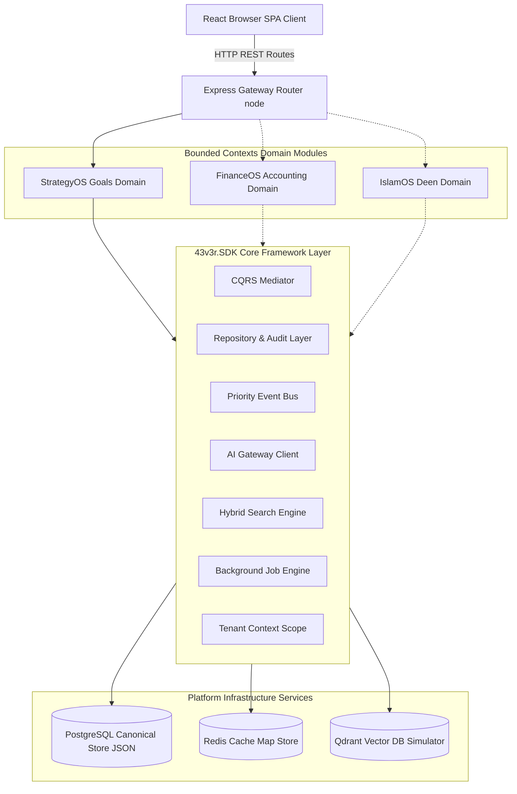
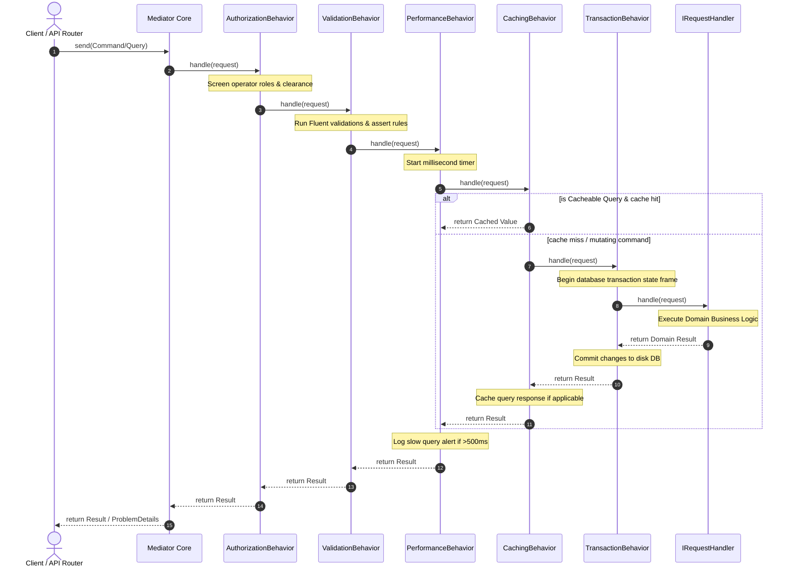
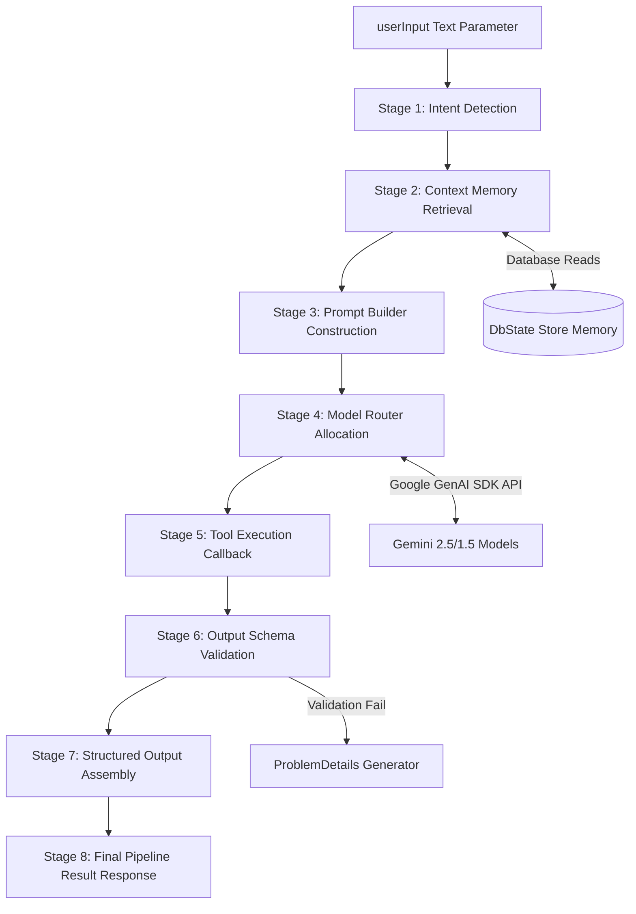

# StrategyOS / Project Jannah — Unified Enterprise Architecture Guide
This document serves as the canonical architectural guide for **Project Jannah (LifeOS) v6.1**. It outlines the structural design, boundaries, and components of the Modular Monolith powered by the **43v3r.SDK** platform framework.

---

## 1. High-Level Modular Monolith & Shared SDK Topology

Our platform is constructed as a **Modular Monolith** with a shared core infrastructure library (**43v3r.SDK**). Bounded contexts (such as `StrategyOS`, and future slices like `FinanceOS` or `IslamOS`) are strictly segregated from one another but depend directly on the SDK to access transactional system capabilities.

---

## 2. Generic MediatR-style CQRS Pipeline Architecture

The `Mediator` pattern decouples command/query triggers from state processors. Before reaching the actual `IRequestHandler`, requests pass through a sequence of sequential pipeline behaviors (decorators) to handle concerns like authorization screening, fluent schema checking, performance alerts, caching, transaction boundaries, and auditing.

---

## 3. The 8-Stage AI Platform Gateway Routing Architecture

No features may directly call the Google Gemini API. Instead, all AI prompts must route through our unified, structured **AI Gateway Pipeline**.

---

## 4. Multi-Tenant Logical Partitioning Invariant

Project Jannah is fundamentally multi-tenant. This constraint is guarded automatically by the system:
1. **Implicit Partitioning**: All tables/entities inherit from `Entity` which contains `tenantId`.
2. **Context Propagation**: `TenantContext` tracks active tenant scopes on every transaction.
3. **Automatic Filtering**: Queries executed through `IRepository` automatically append `TenantId === currentTenantId` logic, shielding customer data boundaries from leakage.
4. **Soft-Delete Shielding**: Deleted entities have `isDeleted = true` and are automatically omitted from standard queries unless specifically requested by an operator with administrator clearance levels.
