# Project Jannah: Life Kernel & Cognitive Core Specifications

This specification details the enterprise architecture, operational pipelines, and design invariants of the **LifeOS Life Kernel & Cognitive Core**. 

All diagrams are fully rendered using **Mermaid**.

---

## 1. System Topology & Kernel Architecture

The Life Kernel serves as the central orchestration bus. All business modules—such as Islam, Health, Finance, and Marriage—interface exclusively via event subscription and command contracts.

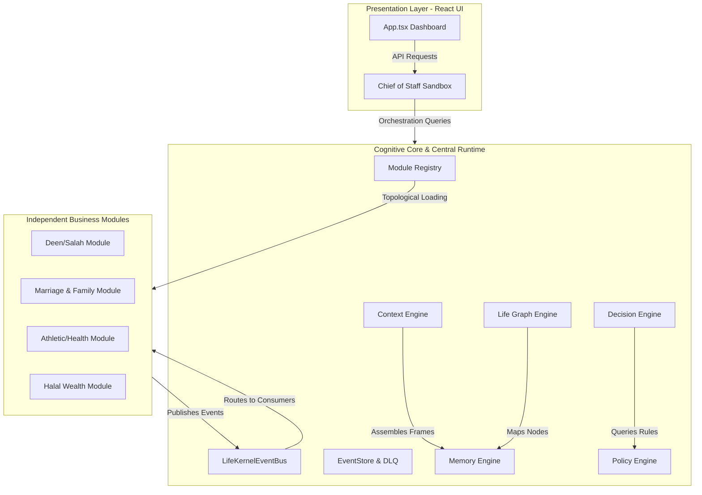

---

## 2. Event System Pipeline

The Event system implements a durable Event Store, exponential backoff retries, and a Dead Letter Queue (DLQ) for fault management.

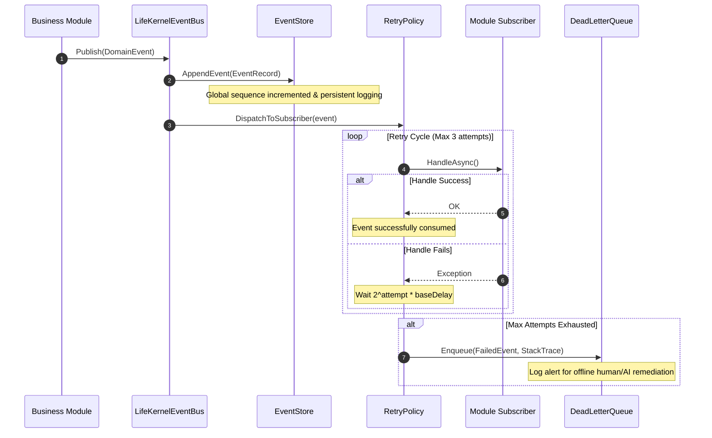

---

## 3. Cognitive Memory Engine

The Memory Engine splits historical records into multi-layer retrieval zones. A background lifecycle sweep decreases the recall probability of inactive short-term transactional memories over time.

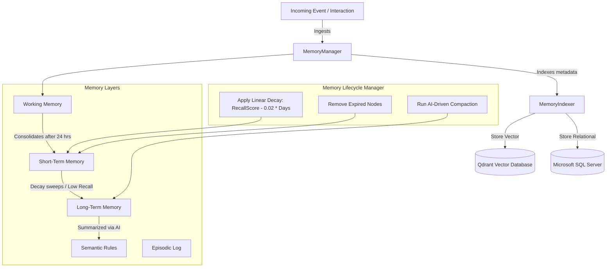

---

## 4. Context Engine & Prompt Assembler

The Context Engine aggregates scattered variables, filters out instructions injection, scores relevance, and minifies JSON payloads to fit the 4KB token budget of Gabriel CoS.

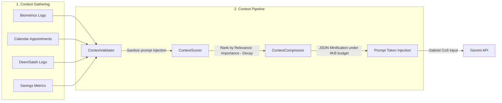

---

## 5. Life Graph Topology

The Life Graph represents a mathematical model of Ethan’s life. All nodes and directional relationship arcs are validated against structural cycles.

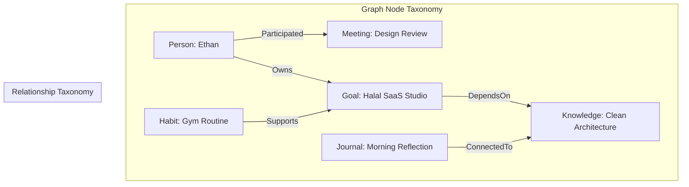

---

## 6. Goal Engine Cascade

Goals cascade down from high-level, long-term visions into monthly projects and daily execution habits, ensuring alignment.

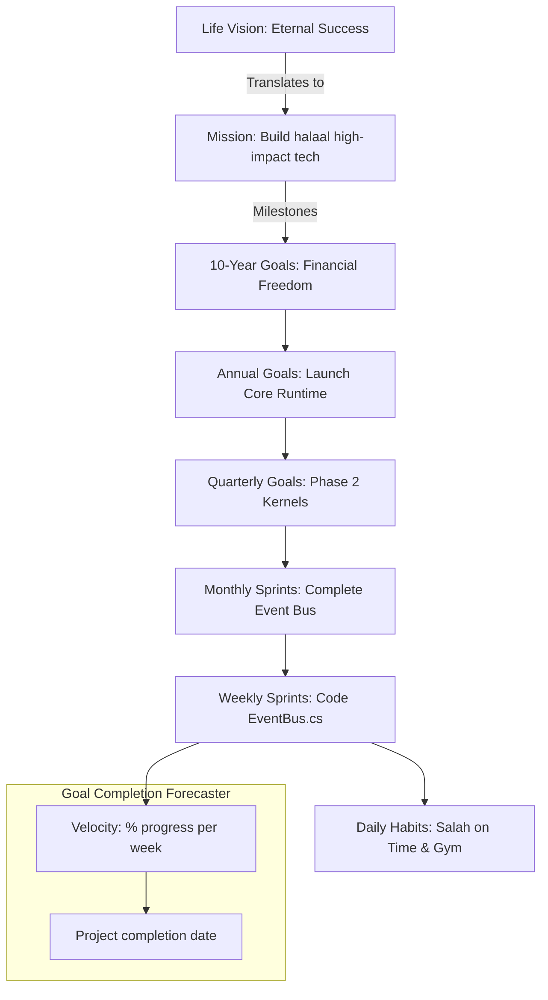

---

## 7. Decision Engine Pipeline

Strategic decisions undergo a robust, multi-stage assessment before being approved and logged.

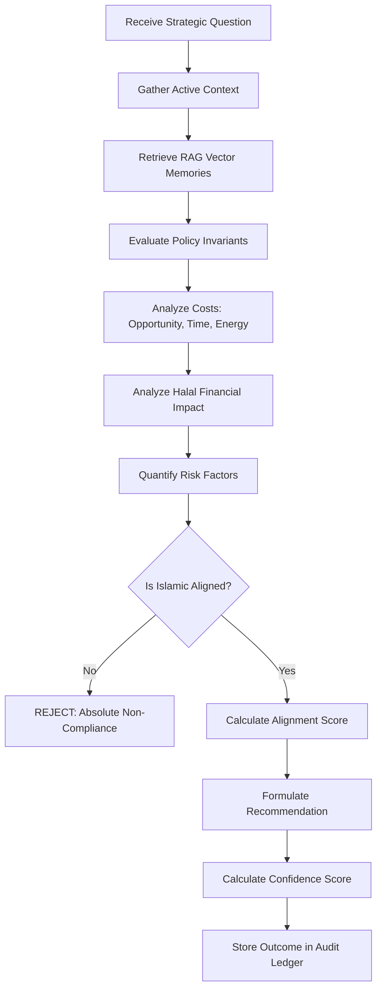

---

## 8. AI Orchestrator Core

Gabriel is supported by specialized sub-agents. Agentic requests that violate financial limits are escalated to the Chief of Staff.

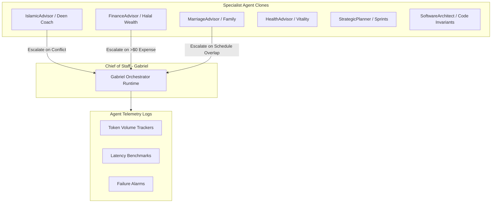

---

## 9. Policy Invariant Checks

The Policy Engine checks proposed schedule changes or actions against immutable life constraints.

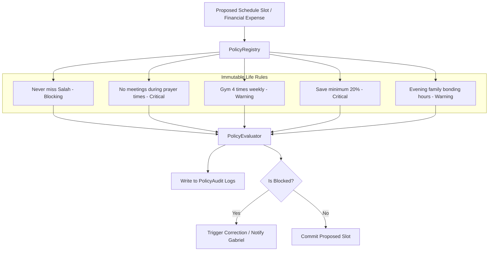

---

## 10. Plugin Loader (Topological Sort)

Modules are registered dynamically at startup and ordered based on their dependency declarations.

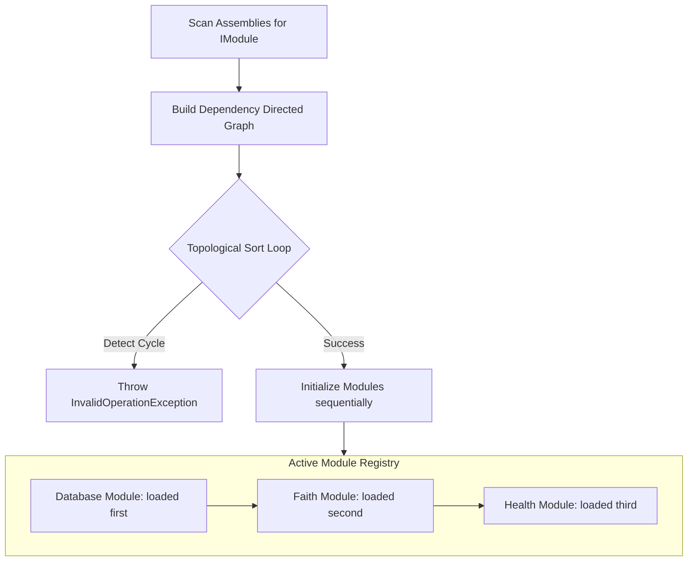

---

## 11. Spiritual-First Scheduler Resolving

The Enterprise Scheduler treats congregational prayer blocks as absolute, immutable constants during conflicts.

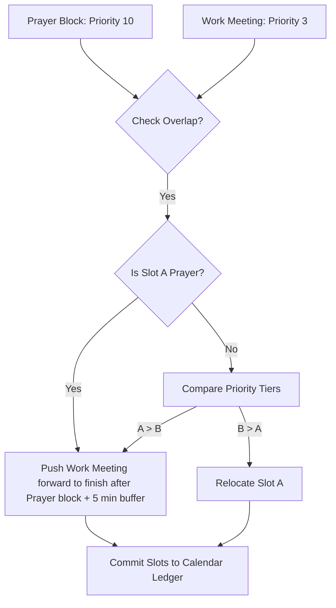

---

## 12. Telemetry Tracker

The diagnostics pipeline monitors latency and compiles performance statistics.

```mermaid
graph LR
    System[Life Kernel Pipeline] -->|Log Event Latency| Telemetry[PerformanceMonitor]
    System -->|Increment Metric Count| Collector[MetricsCollector]

    subgraph Metrics [Compiled Dashboard Aggregates]
        P1[Average Latency per Operation]
        P2[Daily Salah Completeness Ratio]
        P3[Weekly Gym Session Count]
    }

    Telemetry --> P1
    Collector --> P2
    Collector --> P3
```
